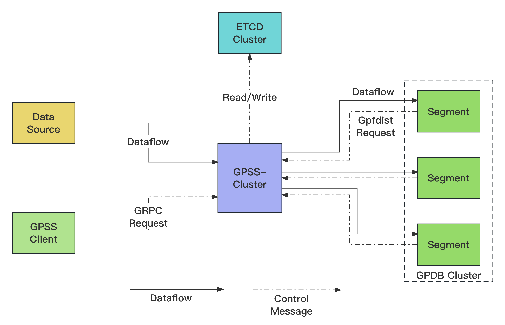
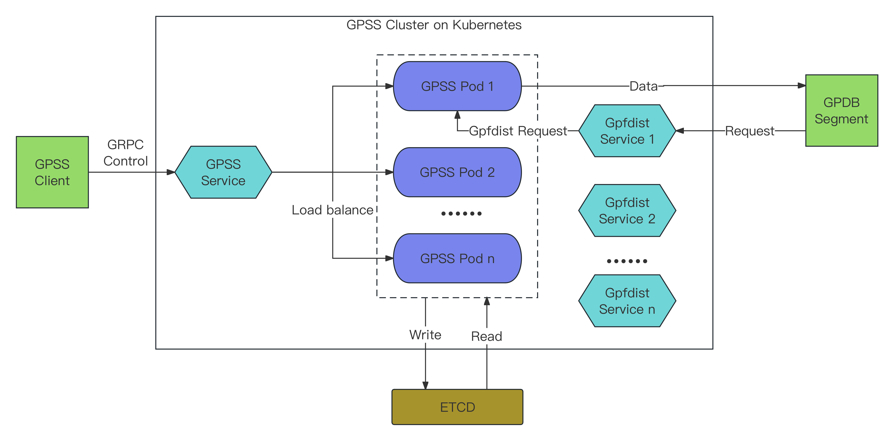
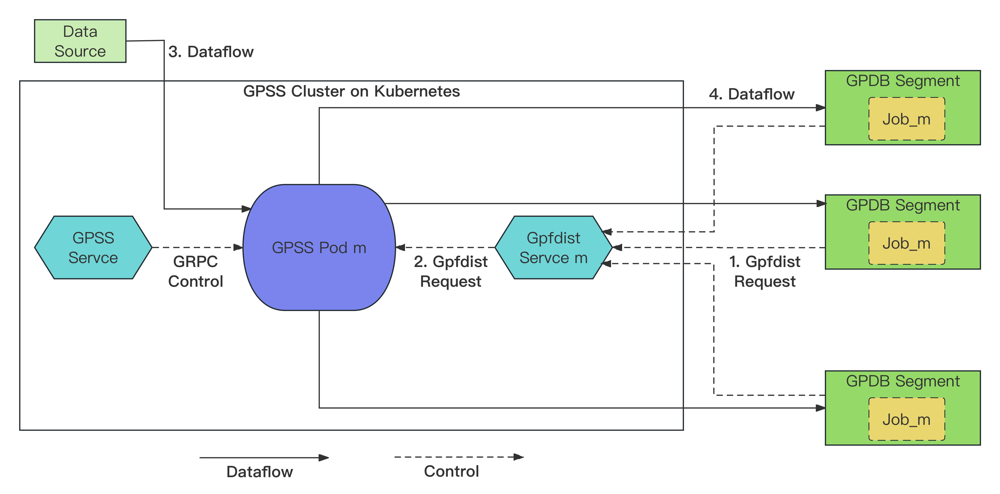
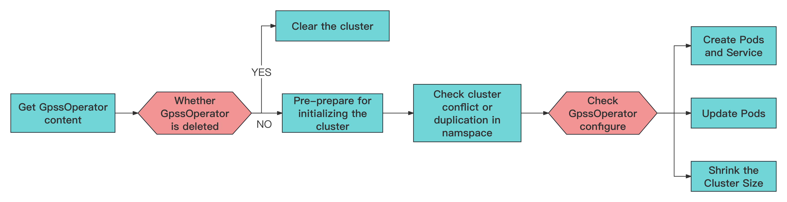

# Design for distributed GPSS on kubernetes

After completing the development of distributed GPSS, the planning of using K8s to manage multiple cooperating GPSS instances that work together came into being. As an open source container orchestration system, K8s supports automated deployment and management of containers, which can effectively improve the stability and flexibility of distributed GPSS running.

## Background

Distributed GPSS (Greenplum Stream Server) supports combining multiple GPSS processes through Etcd to work together for data transmission, effectively overcoming the performance bottleneck of single-node GPSS. However, distributed GPSS also brings certain operational costs for users. For example, when users need to scale up or down the distributed GPSS cluster, they have to manually operate GPSS to achieve their goals. What's more, if certain process instances encounter exceptions and are unable to provide services, customers may incur additional costs to troubleshoot errors and restart the processes.

To provide users with a more stable and convenient service, we develop a distributed GPSS that runs in a k8s environment. Kubernetes supports the automated deployment, scaling, and management of containerized applications, which can effectively reduce the operational costs of managing GPSS clusters. Additionally, Kubernetes offers robust container health monitoring and self-healing capabilities, which enhance the stability of the distributed GPSS system.

To reduce the operational costs for users and make the use of distributed GPSS more convenient, we develope GPSS-operator. It enables automated management of GPSS clusters in a Kubernetes environment. This allows customers to perform common operational tasks such as scaling, resizing, and upgrading GPSS clusters at a lower cost.

## Design for distributed GPSS on Kubernetes

Just like with distributed GPSS, GPSS clusters running on Kubernetes also need to interact with ETCD, data sources, GPSS clients, and gpdb clusters. GPSS communicates with ETCD to write information related to the internal workings of the cluster and GPSS Jobs. It requests data from the data sources, receives commands from GPSS clients, and responds to data requests from GPDB segments. 

The following image illustrates the interaction between the GPSS cluster and the external components



In a k8s environment, a GPSS pod can access external network IPs outside the k8s environment. However, for external hosts to access pods within the k8s cluster, users need to define a service to expose the external IPs and ports. Then external hosts can access the GPSS pods. 

From the diagram above, we can see that for the data source and ETCD cluster, the GPSS running instances initiate the access themselves, and there is no need to expose the GPSS instance's IP and port externally for them. However, for gpdb and gpsscli, we need to create services to enable access from external sources.

To ensure the smooth operation of distributed GPSS in the Kubernetes environment, we have adopted the following architecture.




Distributed GPSS achieves parallel processing of tasks by distributing each task to a single GPSS instance. This also means that a task is serviced by only one GPSS process for data import at any given time. When GPDB requests data based on the URL of an external table, it is crucial that the IP address of the external table corresponds to the GPSS instance where the task resides. This ensures the smooth flow of data import.

In the situation on Kubernetes (K8s), each GPSS instance corresponds to a pod in K8s. Each pod needs to expose its own IP address and port to provide an accessible gpfdist service to the gpdb cluster outside of K8s.

The requests sent by the GPSS client do not need to specify a specific GPSS Pod. Therefore, we can expose a single access entry to the GPSS client and evenly distribute the requests to the various GPSS pods through the load balancing strategy provided by Kubernetes.

Next, let's delve into how distributed GPSS running on Kubernetes handles requests from gpdb and GPSS clients.

### Request From GpssCli

The GPSS client sends GRPC requests to the GPSS cluster for jobs such as submitting, starting, stopping, and monitoring data streaming jobs. Regardless of which GPSS instance receives the GRPC request, it will utilize ETCD to notify the GPSS instances in the cluster, enabling effective management of the requested jobs.


### Dataflow between the GPSS cluster and the GPDB cluster

As mentioned earlier, a task is serviced by only one GPSS process for data import at any given time. For this reason, we have created a corresponding gpfdist service for each GPSS pod, which is responsible for receiving requests from gpdb segments. 

Additionally, as there are no obstacles for internal pods in Kubernetes to access external network nodes, the GPSS pod that receives the data request can directly send data to the gpdb segment using the established network connection when the request was initiated.



### operator mechanism

However, the current automated resource management mechanisms supported by Kubernetes, such as Deployment, do not have the ability to differentiate the managed pod resources and cannot provide an external accessible service for each individual pod internally. If we were to create separate external services for each deployment, it would not meet the consistency requirement of GPSS (where each task can only be handled by a single GPSS service at the same time).

Indeed, we are fortunate to leverage the operator mechanism provided by Kubernetes. This mechanism allows us to define new resource types and develop controllers to manage these resources, enabling the implementation of our designed distributed GPSS architecture running on Kubernetes. With the operator framework, we can automate various management tasks, simplify deployment, and ensure the smooth operation of our distributed GPSS system in the Kubernetes environment.


## Design for CRD --- GpssOperator

Kubernetes Custom Resource Definition (CRD) is an extension mechanism that allows users to define their own custom resources to meet the specific requirements of applications or workloads. It enables users to create custom resource types in Kubernetes that can be managed and operated like built-in resources such as Pods, Services, and others.

In practical usage, CRDs are often used in conjunction with operator programs to achieve automated operations and maintenance of resources. The operator program monitors the content of CRD resources and performs create/update/delete operations based on their content. For the GPSS cluster running on k8s, we have also designed a corresponding CRD called GpssOperator. It includes the following fields: 

```
spec:
    description: GpssOperatorSpec defines the desired state of GpssOperator
    properties:
        size:
          type: integer
        cluster:
          type: string
        image:
          type: string
        account:
          type: string
        gpss_config:
          type: string
    type: object
```

The `size` variable defines the size of the GPSS cluster, including the coordinator.

The `cluster` is used to differentiate one GPSS cluster running in the same namespace. Within a single k8s namespace, there may be multiple distributed GPSS clusters running concurrently. The "cluster" variable is crucial for managing and controlling these clusters individually. Users must ensure the `cluster` name is unique within a given  namespace.

The `image` variable specifies the URL of the container image on which the containers rely. When the URL is modified, it triggers the operator program to automatically upgrade the container image.

The `account` variable represents the name of the account for the permissions that the customer's GPSS Pod should have. Users can define this account name according to their requirements. If not defined, the default name "GPSS-permission" will be used.

The `gpss_config` variable is a JSON-formatted string used to define the startup configuration of the GPSS service. It contains the necessary settings and parameters for configuring the GPSS service according to the desired specifications. Please ensure that the value of `Cluster.Id` in the JSON remains consistent with the value of `spec.cluster`. If they are not the same, the Operator program will modify the value in the config to ensure they are aligned.

Here is an example:

```yaml
apiVersion: GPSS.gpdb.io/v1
kind: GpssOperator
metadata:
  name: gpssoperator-sample
  namespace: gpss-workspace
spec:
  size: 3
  cluster: gpfdist
  image: pivotal/gpss:latest
  account: pod-account
  gpss_config: |
    {
        "ListenAddress": {
            "Host": "",
            "Port": 5000
        },
        "Gpfdist": {
            "Host": "",
            "Port": 8090
        },
        "Cluster":{
            "Id": "gpfdist",
            "Port": 5001,
            "Etcd": {
                "Endpoints": ["etcd:2379"]
            }
        }
    }
```

## Design for controller of GPSS cluster on K8s --- GPSS-operator


As mentioned earlier, for the overall architecture of distributed GPSS on Kubernetes, the Custom Resource Definition (CRD) serves as a blueprint or specification. It defines the custom resources specific to our GPSS cluster. On the other hand, the operator program plays a crucial role in creating and managing the cluster based on the specifications outlined in the CRD. It acts as the "engine" that interprets and executes the instructions provided by the CRD, ensuring the proper functioning and management of the GPSS cluster within the Kubernetes environment.

The following diagram illustrates the execution flow of the operator. Whenever there is a change in the CRD resource (in this case, the user-defined GpssOperator), it triggers the operator program to retrieve the latest content of GpssOperator. Based on the content, the operator then proceeds to configure the GPSS cluster accordingly.



- In the initial step, the GPSS cluster checks whether the GpssOperator has been deleted. If it has been deleted, the operator program proceeds to release all internal resources within the cluster. This ensures that any resources associated with the deleted GpssOperator are properly cleaned up and freed within the cluster.
- If the Operator is executed for the first time, it will initialize the cluster and create the necessary permissions for the GPSS cluster pods. 
- The operator program performs a check to ensure that the Cluster specified in the GpssOperator does not have any duplicates or conflicts. 
  - The operator strictly prohibits assigning the same cluster to multiple GpssOperators. This restriction is in place to prevent any management information errors and ensure predictable behavior. 
  - the operator prohibits modifying the cluster variable within the GpssOperator. This is done to prevent any potential resource leaks.
- According to the content of the GpssOperator, we will configure the cluster accordingly. 
  - If the desired size of the cluster is reduced compared to the current size, the operator will scale down the cluster. It will remove the corresponding number of pods and services to shrink the cluster accordingly.
  - If the desired size of the cluster is increased compared to the current size, the operator will scaling up the cluster. It will create new pods and services according to the new size specified by the GpssOperator.
  - If the user changes the Image URL, the operator will create a new pod based on the updated URL. This allows users to upgrade the cluster by specifying a different Image URL. 

## User Manual

### Template for defining a GpssOperator

```yaml
apiVersion: GPSS.gpdb.io/v1
kind: GpssOperator
metadata:
  name: <The resource name, unique within the namespace>
  namespace: <The namespace in which the resource and cluster are>
spec:
  size: <An integer number greater than 0>
  cluster: <A namespace-specific unique name>
  image: <The URL of the running container image>
  account: <The permission account for the GPSS pod. No need to be  unique>
  gpss_config: <GPSS startup configuration>
```

This is an example:

```yaml
apiVersion: GPSS.gpdb.io/v1
kind: GpssOperator
metadata:
  name: gpssoperator-sample
  namespace: GPSS-workspace
spec:
  size: 3
  cluster: gpfdist
  image: pivotal/gpss:latest
  account: pod-account
  gpss_config: |
    {
        "ListenAddress": {
            "Host": "",
            "Port": 5000
        },
        "Gpfdist": {
            "Host": "",
            "Port": 8090
        },
        "Cluster":{
            "Id": "gpfdist",
            "Port": 5001,
            "Etcd": {
                "Endpoints": ["etcd:2379"]
            }
        }
    }
```


### Create a cluster

Creating a distributed GPSS cluster on Kubernetes requires three steps:

-  Install the GpssOperator Custom Resource Definition (CRD) in a Kubernetes environment.
     - TODO


- Deploy your GpssOperator yaml configure on K8s


- Deploy the operator container on K8s into the same namespace of GpssOperator.
  - Dockerfile example:
    ```
    # Your own compiling operating system
    FROM centos:8
    WORKDIR /workspace

    # manager is the executable file from compiling the operator code
    COPY manager workspace/manager 
    USER 65532:65532

    ENTRYPOINT ["workspace/manager"]
    ```
  - Build the image and push to the repository
    ```bash
    docker build <folder> -t <repository_url>/operator:v1
    docker push <repository_url>/operator:v1
    ```
  - Applyment of images on K8s (example)
    ```yaml
    apiVersion: rbac.authorization.k8s.io/v1
    kind: ClusterRole
    metadata:
      name: operator-role
    rules:
    - apiGroups: ["gpss.gpdb.io", "", "rbac.authorization.k8s.io"]
      resources: ["*"]
      verbs: ["*"]
    ---
    apiVersion: v1
    kind: ServiceAccount
    metadata:
      name: operator-account
      namespace: gpss-workspace
    ---
    apiVersion: rbac.authorization.k8s.io/v1
    kind: ClusterRoleBinding
    metadata:
      name: operator-rolebinding
    subjects:
    - kind: ServiceAccount
      name: operator-account
      namespace: gpss-workspace
    roleRef:
      kind: ClusterRole
      name: operator-role
      apiGroup: rbac.authorization.k8s.io
    ---
    apiVersion: v1
    kind: Pod
    metadata:
      name: operator-new
      namespace: gpss-workspace
    spec:
      containers:
      - name: operator
        image: <repository_url>/operator:v1
      serviceAccountName: operator-account
    ```

### Update the cluster

By modifying the value of the "image" field, it is possible to perform cluster upgrades and rollbacks. 

For example:

```bash
# Update
image: pivotal/gpss:v1  => image: pivotal/gpss:v2

# Rollback
image: pivotal/gpss:v2  => image: pivotal/gpss:v1
```

### Expend/Shrink the cluster

Updating the value of `size` in GpssOperator allows for cluster scaling, both upscaling and downscaling.

```bash
# Expend
size: 3 ==> size: 5

# Shrink
size: 5 ==> size: 3
```

### Delete the cluster

You can use kubectl to delete the GpssOperator resource to clean up the cluster it created. 

```bash
kubectl delete GpssOperator <name>
```