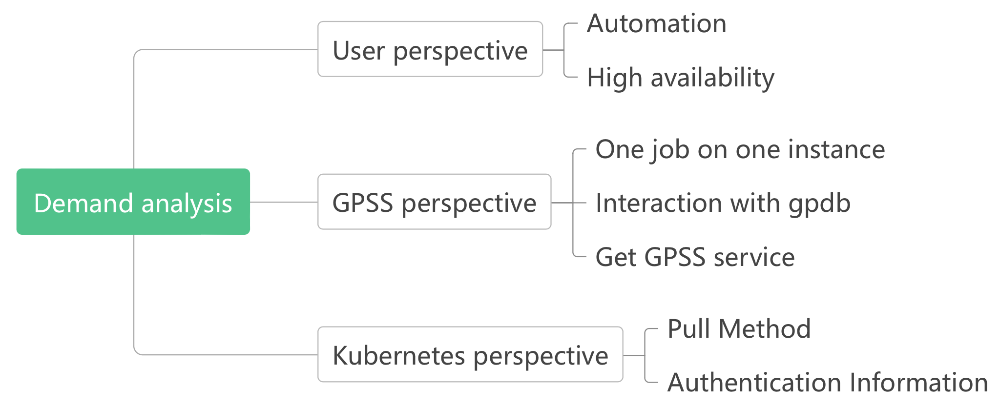
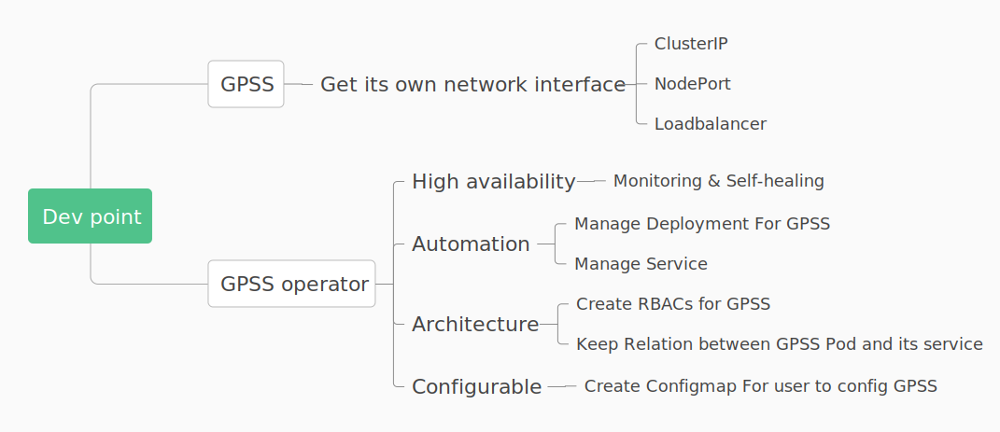

# Design for distributed GPSS on kubernetes

After completing the development of distributed GPSS, the planning of using K8s to manage multiple cooperating GPSS instances that work together came into being. As an open source container orchestration system, K8s supports automated deployment and management of containers, which can effectively improve the stability and flexibility of distributed GPSS running.

## Background

Distributed GPSS (Greenplum Stream Server) supports combining multiple GPSS processes through Etcd to work together for data transmission, effectively overcoming the performance bottleneck of single-node GPSS. However, distributed GPSS also brings certain operational costs for users. For example, when users need to scale up or down the distributed GPSS cluster, they have to manually operate GPSS to achieve their goals. What's more, if certain process instances encounter exceptions and are unable to provide services, customers may incur additional costs to troubleshoot errors and restart the processes.

To provide users with a more stable and convenient service, we develop a distributed GPSS that runs in a k8s environment. Kubernetes supports the automated deployment, scaling, and management of containerized applications, which can effectively reduce the operational costs of managing GPSS clusters. Additionally, Kubernetes offers robust container health monitoring and self-healing capabilities, which enhance the stability of the distributed GPSS system.

To reduce the operational costs for users and make the use of distributed GPSS more convenient, we develope GPSS-operator. It enables automated management of GPSS clusters in a Kubernetes environment. This allows customers to perform common operational tasks such as scaling, resizing, and upgrading GPSS clusters at a lower cost.

## Demand Analysis

To implement a distributed gpss running on Kubernetes, we first need to understand the product requirements. These requirements primarily come from three aspects: customer expectations, the characteristics of the product itself, and the demands brought by the Kubernetes environment.

First, from the customer's perspective, this product should simultaneously offer the advantages of high availability and automated operations. Kubernetes inherently provides capabilities for automated deployment and operations, and it also offers stable and customizable development interfaces for developers. By leveraging the capabilities provided by Kubernetes, we can fully deliver a high-availability and automated distributed gpss solution to our customers.

Due to the design of GPSS itself, the GPDB cluster must obtain data from specific GPSS instances. Additionally, GPDB is challenging to run in a Kubernetes environment. These two points mean that each GPSS needs to expose a network interface that can be accessed externally from Kubernetes. Moreover, GPSS must be able to obtain this network interface to generate external tables for GPDB.

To enable Kubernetes to pull the GPSS instance images, we need to consider both the user's network environment and the image location, and allow users to customize the way images are pulled and provide authentication information.

## Design for distributed GPSS on Kubernetes

Just like with distributed GPSS, GPSS clusters running on Kubernetes also need to interact with ETCD, data sources, GPSS clients, and gpdb clusters. GPSS communicates with ETCD to write information related to the internal workings of the cluster and GPSS Jobs. It requests data from the data sources, receives commands from GPSS clients, and responds to data requests from GPDB segments. 

The following image illustrates the interaction between the GPSS cluster and the external components.

From an internal perspective, the GPSS cluster in Kubernetes is approximately as shown in the diagram below. 

The internal cluster is mainly composed of three parts. The GPSS service is used to receive grpc requests from external GPSS clients. Each pod is a GPSS instance, responsible for reading data from data sources, processing it, and sending it. The gpfdist service provides a network interface for external gpdb to access the data.

In the above architecture, it is important to note that each pod must have a corresponding gpfdist service. This gpfdist service must be associated exclusively with its corresponding pod, and the pod must rely on its gpfdist service to dispatch external tables to gpdb. This is because gpdb can only obtain data from the GPSS instance that dispatches the external table. This constraint arises from the characteristics of distributed GPSS. For more details, you can refer to the following link.

So how can we ensure the correspondence between pods and services? In Kubernetes, a service can find its corresponding pod through a selector, but how should GPSS instances find their corresponding services? This requires us to make appropriate developments in the operator and GPSS code to achieve such a correspondence.

## Establishing the relationship between pods and services.

In our product, we store service information in the labels of the pod. The pod obtains its own information, thereby retrieving the corresponding service information, completing initialization, and proceeding with subsequent data flow services. This is illustrated in the diagram below:

Specifically, we will insert a key-value pair into the labels of a created pod: `"app.kubernetes.io/app": Service_n`. Additionally, when the Operator detects that the label has been successfully inserted, it will create a service with a name identical to the value. This way, the service can find the pod with the corresponding key-value pair through the selector, and the pod can also find the service from its labels.

# Development analysis

Based on the above introduction of the GPSS on Kubernetes architecture and the features summarized in our requirements analysis, we have developed a series of development plans. These mainly include the following aspects:

The first aspect is the development related to GPSS: GPSS must have the capability to obtain its corresponding gpfdist service. For different types of services, different handling logic needs to be developed.

On the other hand, the development of the Operator mainly includes the following four aspects:
-  To ensure high availability, we need to monitor the cluster and promptly restore the cluster state to the desired state.
- To ensure automation, we need to programmatically create the corresponding deployments, services, and other resources for customers.
- To build a cluster in a K8s environment, we need to create the permissions for pods to query services and maintain the relationship between services and pods.
- To support customers in configuring GPSS startup parameters independently, we need to support user-defined startup configurations in the CRD and create corresponding ConfigMaps for the pods.

By organizing the development points of GPSS functionalities, we can outline the key responsibilities of the GPSS operator.

This mainly includes: managing deployments, RBACs (granting pods the necessary permissions to access services), ConfigMaps, pods and services, and establishing the relationship between pods and services.

## Implemention

### How to manage RBACs & ConfigMaps

For RBACs and Configmaps, there is no update logic, so their management is relatively simple and they only need to be created when they do not exist.

### How to manage Deployments

For the management of deployments, it is necessary to consider the update logic. When a deployment exists, we need to update the deployment's specification based on the latest definition of the gpsscluster.

### How to manage Pods
For Pods, we need to add specific labels to establish a one-to-one relationship between the Pod and the Service. The general process is shown in the diagram below. 

It is important to note that during the process of traversing existing Pods and adding labels, there may be situations where labeling fails. In such cases, we need to temporarily skip these Pods and continue with the subsequent process. The operator will attempt to add the label to the Pod again when the next event triggers the operator.

### How to manage Services

The management of Services mainly includes four scenarios.

For gpss services, we need to check the cluster size. If it is 0, the operator will delete the gpss service. If the cluster still exists, we will check the service type and update the service if it differs.

For gpfdist services, we first check whether these services have corresponding Pods. If they do not, the service will be deleted.

Next, the operator will create corresponding services based on the newly labeled Pods. 

Finally, based on the list of previously labeled Pods, it will check whether each Pod has a corresponding service. If not, or if the type is inconsistent with what is defined in the gpsscluster, the Pod will be recreated, and consequently, a new service will be created.

